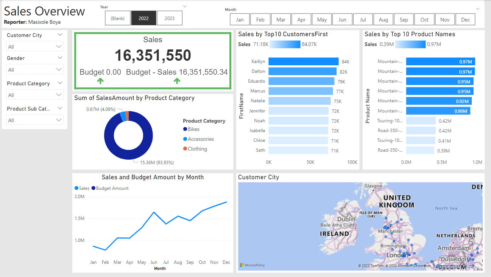

# Interactive Client Sales Dashboard

## Project Overview

This project aims to transform a static sales report into an interactive Power BI-based dashboard. The primary goal is to provide a detailed overview of product sales, customer engagement, and performance against budget, offering valuable insights to stakeholders.

## Project Name

**Interactive Internet Sales Dashboard with Budget Comparison**

## Project Description

Designed and developed an interactive Power BI-based Internet Sales Dashboard, enabling the analysis of product sales, client engagement, and performance against budget, enhancing data-driven decision-making capabilities.

## Business Demand Overview

- **Reporter:** Masixole Boya
- **Task:** Visual interactive dashboards and sales reporting, budget comparison
- **Systems Needed:** Power BI, CRM System
- **Other Information:** Budgets are in the form of a spreadsheet

## Value for Different Stakeholders

| Role in the Business   | Will Get                                      | Usefulness                                                  | Will Receive                            |
|------------------------|----------------------------------------------|-------------------------------------------------------------|----------------------------------------|
| Sales Manager          | A detailed overview of sales                | Can follow better which customers and products sell the best | A Power BI dashboard that updates daily |
| Sales Representative 1 | A detailed overview of sales per customer   | Can follow up customers that buy the most and who must sell more to | A Power BI dashboard with customer filtering |
| Sales Representative 2 | A detailed overview of sales per product    | Can follow which products sell the most                      | A Power BI dashboard with product filtering |

## Project Implementation

1. **Data Collection and Cleaning:**
   - Gather sales, product, client, and budget data.
   - Clean and preprocess the data.

2. **Data Visualization Tools:**
   - Utilize Power BI for dashboard creation.

3. **Data Exploration:**
   - Explore the data to understand its structure and relationships.

4. **Dashboard Components:**
   - Design the interactive dashboard with sales trends, client details, and budget comparisons.
   
5. **Interactivity:**
   - Enable filtering for salespersons, products, and clients.

6. **Budget Comparison:**
   - Integrate budget data and create visual comparisons.

7. **Testing and Feedback:**
   - Gather feedback and make improvements.

8. **Documentation:**
   - Create a user guide for dashboard navigation.

9. **Presentation:**
   - Showcase the project's problem, solution, and benefits.

10. **Sharing and Security:**
    - Configure sharing and security settings in Power BI.

## Tools Used

- Power BI
- SQL Server

## Project Status

The project is ongoing. The current phase involves data extraction and transformation.

## Usage

To use the dashboard:
1. Clone the repository.
2. Open the project in Power BI Desktop.
3. Connect it to your SQL Server database.
4. Follow the documentation for usage instructions.

## License

This project is licensed under the [MIT License](LICENSE).
